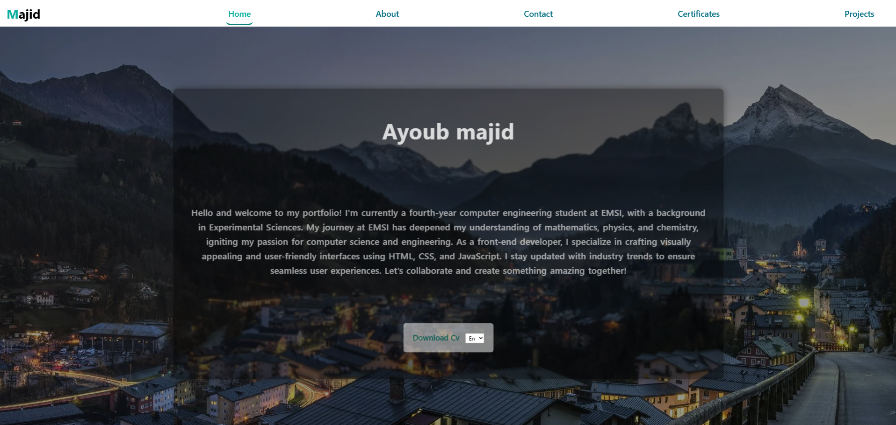

# My Portfolio Project

[View Portfolio](https://lnkd.in/eZjtXTZ3](https://ayoubmajid67.github.io/Portfolio/HTML/home.html) ✔️ 

🚀 **Exciting News**: I’m thrilled to introduce my new portfolio project, a testament to simplicity and functionality! It is organized into five key sections:

## Sections

1. **Home**: A succinct introduction offering a glimpse into my background and professional journey.

2. **About**: Dive deeper into my story, where you can explore my skills, achievements, and the experiences that have shaped my career.

3. **Contact**: Connect with me effortlessly through various social media channels, ensuring we stay in touch.

4. **Certificates**: Browse a comprehensive list of my achievements, reflecting my commitment to continuous learning and skill development.

5. **Projects**: Explore a showcase of my work, offering a firsthand look at the projects I’ve been passionate about.

## Purpose

This portfolio is designed to provide a dynamic and informative representation of my professional journey, making it easier for colleagues and potential collaborators to understand my background and expertise. I’m excited to share it on LinkedIn and look forward to connecting with all of you!

**#Portfolio #ProfessionalJourney #LinkedInSharing** 📁🌟

